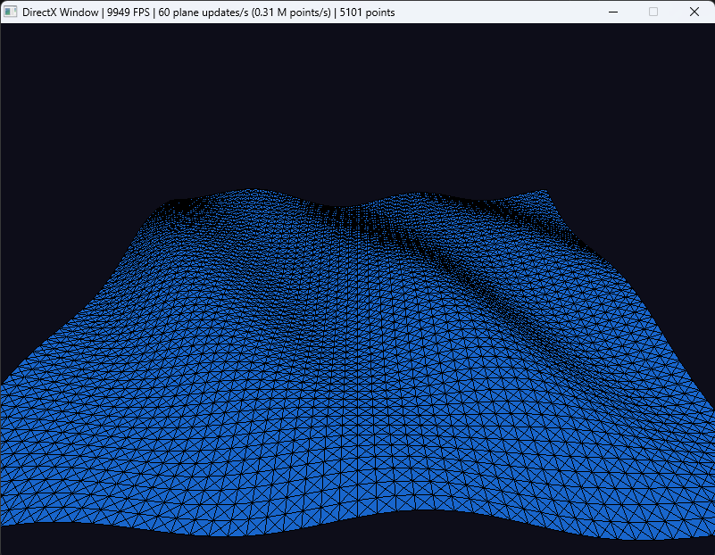

# 2026-10-06

Day 3 of working on my PhD prototype. 
I now fully integrated Gerstner algorithm with its configurable parameters.

"The waves also have an infinite length making them too generic." This remark from yesterday
was due to the single wave algorithm. Since I can now add multiple waves, the illusion works.

I also made a "calculusfrequency" parameter that will limit how many times I will update my plane.
The goal is simple: increase fps by limiting the updates/second.

**What I did**
- Integrate different waves with different parameters (Gerstner)
- Add real-time performance metrics 
- Make a parameter that limits the frequency of calculus for the heights of the points

**Problems met**
- Limiting my AI usage

**What I will do**
- Add a log file and a viewer for it
- Think about chunks for procedural generation
